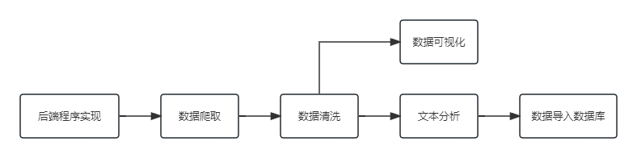
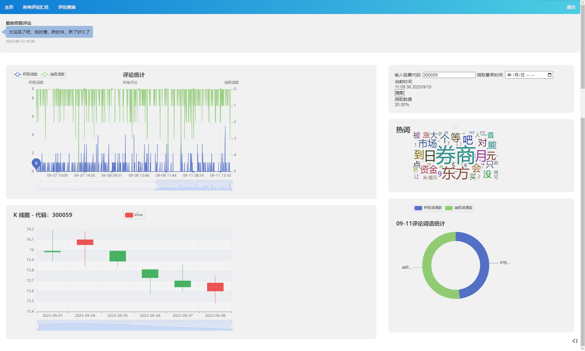
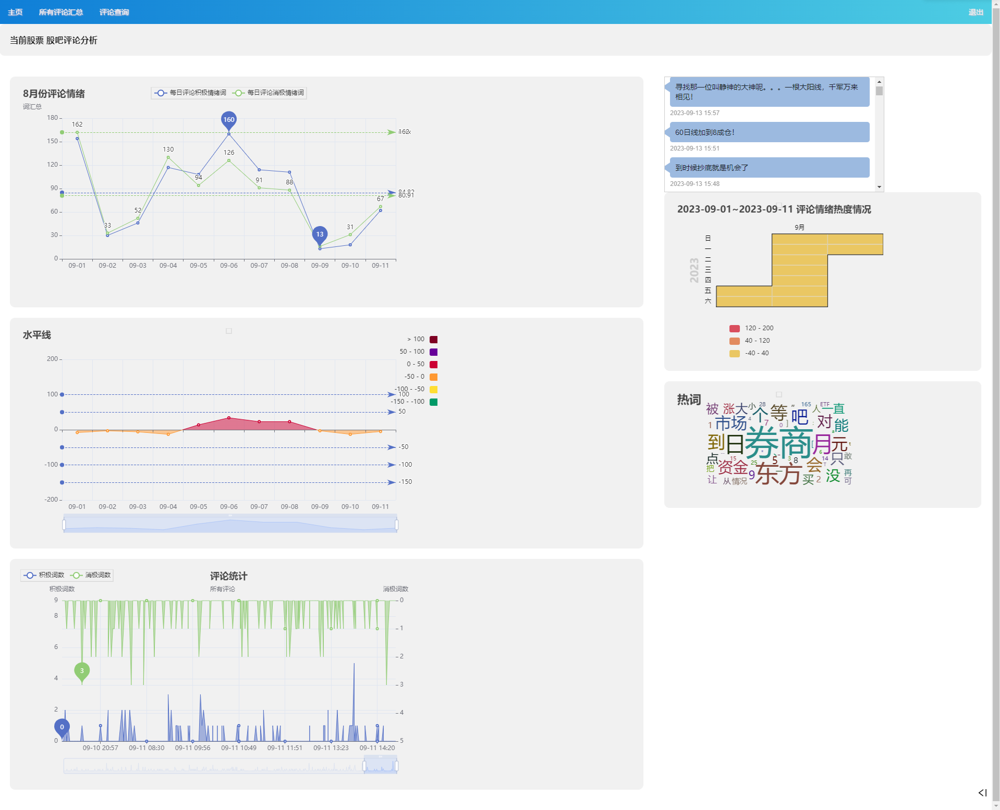
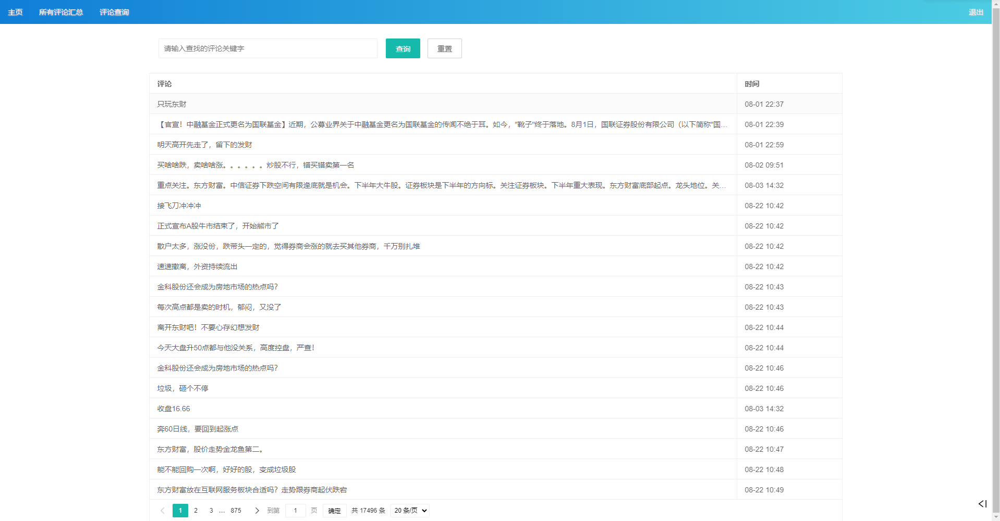

# 需求分析

## 项目设计的目的

本项目设计的目标是开发一个网络系统，用于分析投资者的情绪，并为用户提供有关股票市场的有用信息。具体功能有：

1. 实现用户登录和注册功能，确保用户能够个性化设置和保存数据。
2. 实现论坛信息的网络爬取和收集功能，确保能够获取到充分的帖子数据。
3. 实现情绪分析功能，通过文本分析技术对帖子内容进行情感分析。
4. 提供信息查询模块，允许用户查询特定时间段内的情绪分析结果。
5. 提供数据可视化功能，以图形方式展示多年来投资者情绪的波动趋势。
6. 提供数据导出功能，允许用户将相关数据导出为Excel或Word文档。

## 项目设计基本思想

本项目的设计基本思想是构建一个综合性的网络系统，能够自动获取股票论坛的帖子信息，对这些信息进行情感分析，然后将分析结果以直观和可操作的方式呈现给用户。

# 解决方案

## 后端设计

### 框架选择

选用FLASK作为本Web项目开发的基础框架。

### 数据爬取

在本项目中，采用了基于Selenium库的数据爬取方法，以获取目标网页上的评论文本和评论时间：

1. 选择爬取工具和目标网页：
   - 使用Selenium库，并配置了使用Chrome浏览器的webdriver。
   - 目标网页是位于 https://guba.eastmoney.com/list,300059.html 的股票讨论区页面，这个页面包含了所需要的股民情绪的评论数据。

2. 使用Selenium打开目标网页：
   - 使用webdriver模块来启动Chrome浏览器，并访问目标网页。

3. 解析网页内容：
   - 使用lxml.etree库来解析目标网页的HTML内容。
   - 主要关注两个部分的数据：评论文本和评论时间。
   - 通过查找HTML中的特定类名（class="content"和class="basic_info"）来定位评论文本和评论时间所在的位置。

4. 存储数据：
   - 将爬取到的评论文本和评论时间存储到一个数据结构中，通常是一个DataFrame。
   - 这个DataFrame可以方便后续的数据清洗、分析和处理。

5. 导出数据：
   - 最后，将爬取到的数据导出到CSV文件，以便进行进一步分析，或进行数据可视化。

通过以上步骤，成功地实现了从目标网页上爬取评论文本和评论时间的功能，为后续的数据分析和可视化提供了基础数据。

### 评论文本分析

在项目的文本分析部分，对爬取的评论文本进行了深入分析，以便对数据进行可视化：

1. 读取爬取导出的 CSV文件：
   - 首先读取之前爬取并导出的CSV文件，这个文件包含了评论文本和评论时间等数据。

2. 列出情绪评判标准词：
   - 为了进行情感分析，创建了两个列表，一个包含好词汇，另一个包含坏词汇。
   - 这些词汇列表是根据项目需求和领域知识事先准备的，用于评估评论中的情感倾向。

3. 使用jieba库进行文本分词：
   - 使用jieba库将评论文本进行分词处理，将长句子拆分成单个词汇的列表。
   - 分词后，可以得到每个评论的词汇列表，以便后续分析。

4. 情感分析：
   - 对分词后的结果，使用预先准备的好词和坏词列表进行情感分析。
   - 统计每日评论中好词和坏词的数量，以及它们的比例。
   - 这个步骤帮助量化每日评论中的情感倾向，了解投资者对该股票的情感反应。

5. 导出数据：
   - 最后，将进行情感分析后得到的数据导出为CSV文件。
   - 这个文件包含每日的好词、坏词数量和好坏词比例，可以用于后续的可视化和进一步分析。

### 数据可视化

在项目的数据可视化部分，使用了pyecharts库来将文本分析的结果转化为直观的图表，以便更好地理解和传达数据：

1. 读取文本分析结果 CSV：
   - 首先读取之前进行文本分析所得到的CSV文件，这个文件包含了每日评论的情感分析结果，包括好词、坏词数量以及好坏词比例。

2. 绘制按时间所有评论好坏词折线图：
   - 使用pyecharts库创建折线图，将好词和坏词的数量随时间的变化可视化展示。
   - 这个图表帮助追踪评论情感随时间的趋势。

3. 绘制每日好坏词比例：
   - 使用pyecharts库创建柱状图，显示每日好坏词的比例。
   - 这个图表有助于快速了解投资者情感倾向的变化。

4. 绘制每日好坏词水平线：
   - 使用pyecharts库创建水平线图，以直观展示每日好词和坏词的数量。
   - 这个图表可用于识别异常情况或关键时间点。

5. 绘制每日重点词云图：
   - 针对每日评论文本，继续使用jieba库进行分词，去除无用词汇，然后计数关键词汇。
   - 使用pyecharts库创建词云图，将每日的关键词以视觉方式呈现出来。
   - 这个图表有助于识别评论中的热门话题和关注点。

6. 绘制每日好坏词饼图：
   - 使用pyecharts库创建饼图，将每日好词和坏词的比例可视化展示。
   - 这个图表帮助更容易地理解情感分析结果。

7. 绘制股票价格走势 K 线图：
   - 基于tushare库，获取了一段时间内股票的价格数据。
   - 使用pyecharts库创建K线图，展示股票的价格走势。
   - 这个图表可用于分析股票价格与评论情感之间的关系。

8. 导出所有图为HTML格式：
   - 最后，将所有图表以HTML格式导出，以便在Web浏览器中查看和分享。

### 数据导入数据库

在项目的数据导入数据库部分，使用了pymysql库来将爬取的结果和文本分析的数据转化为数据库中的记录，以便更好地管理和查询数据：

1. 读取爬取结果的 CSV：
   - 首先读取之前爬取并导出的CSV文件，这个文件包含了评论文本、评论时间和其他相关数据。

2. 逐行将爬取的文本和时间转化为数据库执行 SQL 插入脚本：
   - 对于每一行数据，使用pymysql库构建SQL插入语句，将数据插入到数据库中。
   - SQL插入语句通常包括表名、列名和对应的值，以确保数据按照结构存储在数据库中。

3. 执行SQL插入脚本：
   - 使用pymysql库的执行函数来执行构建的SQL插入语句。
   - 数据库会将每行数据插入到相应的表中，以便后续查询和分析。

通过数据导入数据库，将项目中获取的原始数据有效地存储到数据库中，使得数据更易于管理和查询。这个步骤为项目提供了一个稳定的数据存储基础，以供后续的数据分析和应用使用。

### 后端功能示意图

## 前端设计

### 注册登录界面

在项目中，我们通过Flask框架结合LayUI插件和MySQL数据库实现了注册和登录功能。以下是这一部分的主要实现过程：

1. 注册登录功能的前后端实现：
   - 使用Flask框架创建了注册和登录的后端接口。
   - 在前端使用LayUI构建了用户友好的注册和登录页面。
   - 注册页面包含了非空校验和手机号格式校验。
   - 注册中包含手机号唯一性校验以及两次密码一致性校验。
   - 登录页面包含了用户不存在和密码错误校验。
   - 使用在captcha库在登录页面生成随机验证码，注册页面点击发送短信后，后台随机生成验证码，可在控制台查看。

2. 页面间的跳转衔接：
   - 在页面上，右上角的区域根据用户状态动态显示"登录"或"退出"。
   - 点击"登录"后，跳转到登录页面；登录成功后，跳转回原页面。
   - 在登录页面，点击"注册"按钮可以跳转到注册页面；注册成功后，跳转回登录页面。

3. 根据评论关键字分页模糊查询：
   - 我们实现了一个评论查询功能，用户可以输入关键字并选择分页显示的条数和页数。
   - 前端通过JavaScript将用户的查询条件传递给后端。
   - 后端使用模糊查询来根据关键字查询评论，并进行分页处理。
   - 用户可以点击查询按钮来获取查询结果，也可以点击重置按钮来清空输入框内容。
   - 查询结果以分页方式显示，用户可以翻页查看更多评论内容。

通过以上实现，我们为用户提供了注册和登录功能，使其能够以个性化的方式使用应用，并实现了方便的评论查询功能，提高了用户体验。项目页面间的跳转有序，用户可以轻松地浏览不同的功能页面。

### 网页排版

在项目的网页排版部分，使用了一系列前端技术来呈现数据可视化结果和与后端进行交互。以下是网页排版的主要实现过程：

1. 图表插入：
   - 所有图表都以HTML格式呈现。
   - 使用iframe标签将图表嵌入到网页中。
   - 每个iframe都嵌套在使用CSS设置好样式的box中，以实现固定位置和背景效果。

2. 爬取信息输入和返回到后端：
   - 使用form表单和input标签来实现用户输入。
   - 默认股票代码为300059。
   - 用input标签的datetime-local类型来选择时间。
   - 通过按钮触发JavaScript脚本执行以下步骤：
     - 检测按钮点击事件，获取表单中的输入值。
     - 将输入值封装成JSON并发送到后端。
     - 后端执行爬取函数，返回结果。

3. 进度条实现：
   - 使用JavaScript脚本，每秒发起一次Ajax请求到后端，获取当前进度值和总进度。
   - 通过调整progress-bar的属性来实现进度条的动态变化。

4. 主页顶部最新爬取评论：
   - 直接读取爬取数据的最新评论和对应评论时间。
   - 使用Flask的render_templates将最新评论和评论时间返回给前端。
   - 使用CSS设置评论的样式。

5. 所有评论页滚动评论：
   - 直接读取爬取数据的最新100条评论和对应评论时间。
   - 将数据转化为字典，并选择记录类型转化。
   - 使用Flask的render_templates返回字典数据。
   - 在HTML中使用Django模板标签迭代字典中的每个评论。
   - 使用CSS设置评论的样式。
   - 最底层的box只保留垂直滚动条。
   - 使用JavaScript脚本计算每条评论的边界的偏移像素值。
   - 使用计时器定时执行函数，实现滚动到下一条评论的效果。

通过这些网页排版的实现，为用户提供了一个直观的界面，使其可以轻松地与项目的数据进行交互，浏览最新评论，以及观察情感分析和股票价格走势等可视化数据。这个网页排版部分增强了用户体验，使得项目更易于使用和理解。

### 网页设计展示

- 主界面

- 所有评论汇总

- 评论查询

# 遇到的问题

## 后端设计时遇到的问题

1. 批量评论文本展示的问题
   - 解决：使用Django模块进行解决

2. 网页爬取数据后刷新，js计时器出现无法结束的问题
   - 解决：更改进度条返回的数据，人工设置进度条，使自动进度条改变为人工进度条

3. 如何实现分页查询
   - 解决：前端使用表单提交查询条件，后端接收条件并实现分页查询，返回对应的数据。

## 前端设计时遇到的问题

1. 未登录前禁止用户访问功能页面
   - 解决：通过登陆后后端返回给前端一个session[‘isLogin’]=True，前端判断isLogin的真假来决定页面跳转，为True时，页面间正常跳转，为False时，点击功能页面只跳转到登录页面。退出登录时，isLogin重新赋值为False

2. 最新评论展示和滚动评论实现
   - 解决：通过Flask后端传递数据，使用Django模板标签和JavaScript脚本来展示评论。

# 总结

总的来说，这个项目成功整合了数据爬取、文本分析、数据可视化、数据库管理和前端开发等多种技术和工具，为投资者提供了一个强大的市场情感分析工具。用户可以通过可视化图表深入了解市场情感走势，查询评论内容，以及观察股票价格走势，从而做出更明智的投资决策。项目的结构清晰，页面友好，有望为投资者提供有力地支持和洞见。
